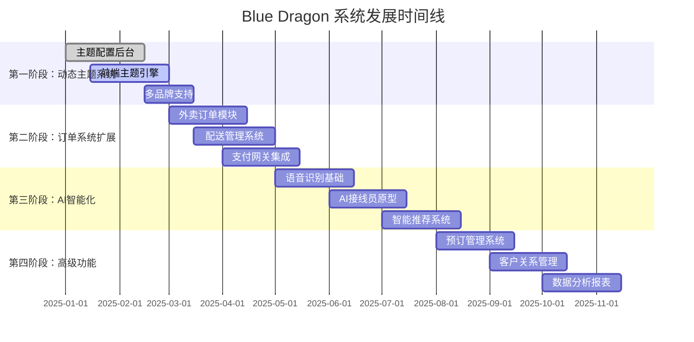
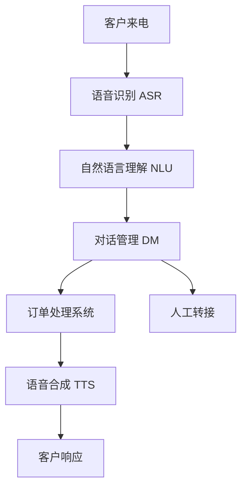

# 🐉 Blue Dragon 餐厅系统升级开发计划
## Restaurant Management System Enhancement Roadmap

### 📈 **产品发展路线图 (Product Roadmap)**



## 🎯 **第一阶段：动态主题系统 (2-3个月)**

### **核心功能设计**
1. **餐厅主题配置界面**
   - 颜色选择器（主色调、辅色、强调色）
   - 字体样式选择（字体族、大小、粗细）
   - 布局选项（卡片样式、间距、圆角）
   - Logo和背景图片上传
   - 实时预览功能

2. **前端主题引擎**
   - CSS变量动态注入系统
   - 主题缓存和加载优化
   - 响应式主题适配
   - 暗色/亮色模式切换

### **技术实现要点**
```javascript
// 主题配置数据结构示例
const themeConfig = {
  id: 'custom-theme-001',
  name: '现代简约风',
  colors: {
    primary: '#1e40af',
    secondary: '#f59e0b', 
    accent: '#10b981',
    background: '#ffffff',
    surface: '#f8fafc',
    text: '#1f2937'
  },
  typography: {
    fontFamily: 'Inter, sans-serif',
    headingWeight: '600',
    bodyWeight: '400'
  },
  layout: {
    borderRadius: '8px',
    cardShadow: '0 4px 6px -1px rgba(0, 0, 0, 0.1)',
    spacing: 'comfortable' // compact | comfortable | spacious
  },
  branding: {
    logo: 'https://...',
    favicon: 'https://...',
    backgroundImage: 'https://...'
  }
}
```

## 🛒 **第二阶段：外卖订单系统 (2-3个月)**

### **功能模块设计**
1. **订单类型扩展**
   - 堂食订单（现有）
   - 外卖订单（新增）
   - 自提订单（Take Away）
   - 预订订单（新增）

2. **配送管理**
   - 配送区域设置
   - 配送费计算
   - 配送时间估算
   - 配送员管理

3. **客户端功能**
   - 地址管理
   - 配送时间选择
   - 订单状态追踪
   - 评价系统

### **数据库架构扩展**
```javascript
// Firebase数据库结构扩展
{
  "BlueDragon": {
    "orders": {
      "dine-in": { /* 现有堂食订单 */ },
      "delivery": {
        "order-id": {
          "type": "delivery",
          "customerInfo": {
            "name": "张三",
            "phone": "+31612345678",
            "address": {
              "street": "Damrak 123",
              "city": "Amsterdam",
              "postalCode": "1012 AB",
              "coordinates": [52.3676, 4.9041]
            }
          },
          "deliveryInfo": {
            "estimatedTime": 30,
            "deliveryFee": 3.50,
            "instructions": "请按门铃",
            "status": "preparing" // preparing | ready | on-the-way | delivered
          },
          "items": [ /* 订单项目 */ ]
        }
      },
      "takeaway": { /* 自提订单 */ },
      "reservation": { /* 预订订单 */ }
    },
    "delivery": {
      "zones": {
        "zone-1": {
          "name": "市中心",
          "radius": 3,
          "fee": 3.50,
          "minOrder": 20.00
        }
      },
      "drivers": {
        "driver-1": {
          "name": "李四",
          "phone": "+31687654321",
          "status": "available",
          "currentOrder": null
        }
      }
    }
  }
}
```

## 🤖 **第三阶段：AI接线员系统 (3-4个月)**

### **AI功能设计**
1. **语音识别系统**
   - 多语言支持（荷兰语、英语、中文）
   - 方言和口音适应
   - 噪音过滤处理

2. **自然语言理解**
   - 订单意图识别
   - 菜品名称匹配
   - 数量和时间提取

3. **对话管理**
   - 智能问答系统
   - 订单确认流程
   - 异常情况处理

### **技术架构**


### **API集成选择**
- **语音识别**：Google Cloud Speech-to-Text / Azure Speech Services
- **自然语言处理**：OpenAI GPT API / Google Dialogflow
- **语音合成**：Google Text-to-Speech / Amazon Polly

## 📅 **第四阶段：预订与CRM系统 (2-3个月)**

### **预订系统功能**
1. **在线预订界面**
   - 日期时间选择
   - 人数和桌位偏好
   - 特殊要求记录

2. **预订管理后台**
   - 预订日历视图
   - 冲突检测和建议
   - 自动确认/提醒

3. **客户关系管理**
   - 客户档案管理
   - 消费历史分析
   - 个性化推荐

## 💰 **投资预算估算**

| 阶段 | 开发时间 | 人力成本 | 外部服务 | 总预算 |
|------|----------|----------|----------|--------|
| 第一阶段：主题系统 | 2-3个月 | €15,000 | €2,000 | €17,000 |
| 第二阶段：外卖系统 | 2-3个月 | €20,000 | €3,000 | €23,000 |
| 第三阶段：AI接线员 | 3-4个月 | €35,000 | €8,000 | €43,000 |
| 第四阶段：预订CRM | 2-3个月 | €18,000 | €2,500 | €20,500 |
| **总计** | **9-13个月** | **€88,000** | **€15,500** | **€103,500** |

## 🎯 **收益预测**

### **直接收益**
- **多品牌授权费**：每个餐厅 €2,000-5,000/年
- **外卖佣金优化**：减少第三方平台依赖，节省8-15%佣金
- **AI接线员节省**：减少人工成本 €30,000/年
- **预订系统收益**：提高座位利用率15-25%

### **间接收益**
- **品牌一致性提升**：提高客户认知度
- **运营效率优化**：减少人工错误和重复工作
- **数据驱动决策**：基于客户数据的精准营销

## ⚡ **立即开始的建议**

1. **第一步**：创建主题配置原型（1-2周）
2. **第二步**：设计Firebase数据库扩展（1周）
3. **第三步**：开发主题管理界面（3-4周）
4. **第四步**：前端主题引擎开发（2-3周）

### **风险控制**
- 分阶段开发，每阶段都有独立价值
- 保持现有系统稳定运行
- 充分的测试和用户反馈
- 技术债务控制

这个发展计划将Blue Dragon从一个餐厅管理系统升级为**全方位的餐饮行业SaaS平台**，具有巨大的商业潜力！

是否要我开始实施第一阶段的动态主题系统原型？